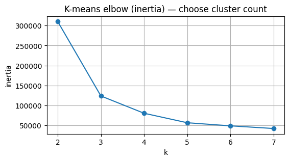
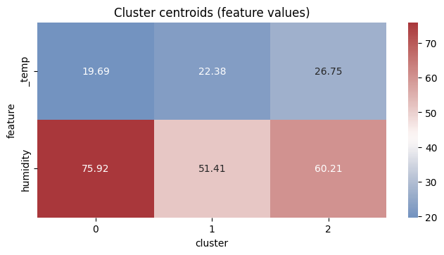
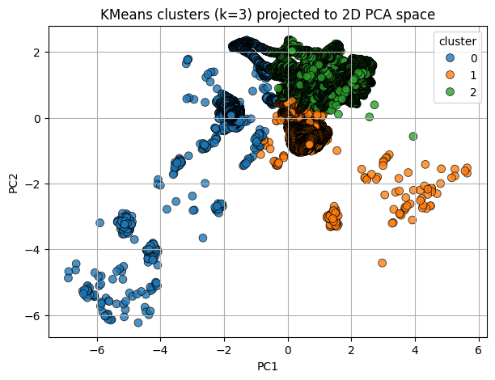

# Cold Chain RL & Telemetry Clustering

Author: Mnyamezeli

Email: m.voyi@outlook.com

GitHub: https://github.com/mnyamezeli

Contact: 0640307021

## Project overview

This repository contains a Cold Chain Reinforcement Learning notebook and supporting code for exploring telemetry data and building simple ML models. The main notebook is `ColdChain_RL_Notebook.ipynb` which demonstrates the following main items:

- K-means clustering + visualizations
- Cluster centroids (heatmap of cluster centers on original feature scale)
- Example output snippets: 1 raw sensor rows, 1 time stamp, images/output.png

## Pitch deck

For presentations, see the project pitch deck (Gamma):

[AI-Driven IoT Supply Chain Optimization — Pitch deck](https://gamma.app/docs/AI-Driven-IoT-Supply-Chain-Optimization-A-Sustainable-Solution-to-pzwr8pun08zxc8t?mode=doc)

## Files of interest

- `ColdChain_RL_Notebook.ipynb` - primary notebook showcasing data loading, K-means clustering, PCA visualization, a simple spoilage model, an OR-Tools VRP helper, and a reinforcement learning environment (PPO training example).
- `src/data_utils.py` - helper utilities for data processing (see repository `src/` folder).
- `iot_telemetry_data 2.csv/iot_telemetry_data 2.csv` - example telemetry CSV included in the workspace (used by the notebook).
- `models/` - contains precomputed models and evaluation artifacts (joblib files and CSVs).

## ML approach (short)

The notebook applies K-means clustering (scikit-learn) to telemetry data to discover operational clusters. Key steps used in the notebook:

- Feature extraction from raw telemetry (temperature, humidity, timestamp-derived features like hour and day-of-week, approximate distance from depot, aggregated time-series features if present).
- Feature scaling using `StandardScaler`.
- Choosing cluster count with an elbow plot (inertia vs k).
- Fitting `KMeans` and assigning cluster labels to telemetry rows.
- Visualizing clusters projected to 2D with `PCA` and `seaborn` scatter plots.
- Displaying cluster centroids on the original feature scale using a heatmap.

## Quick usage

1. Open `ColdChain_RL_Notebook.ipynb` in Jupyter or VS Code and run cells sequentially.
2. Ensure you have the required Python packages installed (see Dependencies).

## Dependencies

Suggested minimal Python packages (use your environment manager):

- numpy
- pandas
- scikit-learn
- matplotlib
- seaborn
- stable-baselines3 (optional, used for RL training example)
- ortools (optional, used for VRP helper)

You can install the basics with:

```powershell
pip install numpy pandas scikit-learn matplotlib seaborn
```

Add `stable-baselines3` and `ortools` if you plan to run the RL training and VRP cells.

## Notes

- The notebook includes example code that prints sample rows and timestamps when the telemetry CSV is available. The README lists "1 raw sensor rows" and "1 time stamp" as example outputs referenced in the notebook documentation.
- If your Python version is newer than some packages support, consider creating a virtual environment with Python 3.10 or 3.11 for best compatibility with `stable-baselines3`.

## License

This project is for educational purposes. No license specified.

## Images

The repository contains several images generated by the notebook and evaluation scripts. A few useful visuals are embedded below — open `ColdChain_RL_Notebook.ipynb` to regenerate them if needed.

- Example outputs / evaluation plots:

  

  

  

If images do not render in your viewer, ensure the image files exist at the paths shown relative to the repository root.
